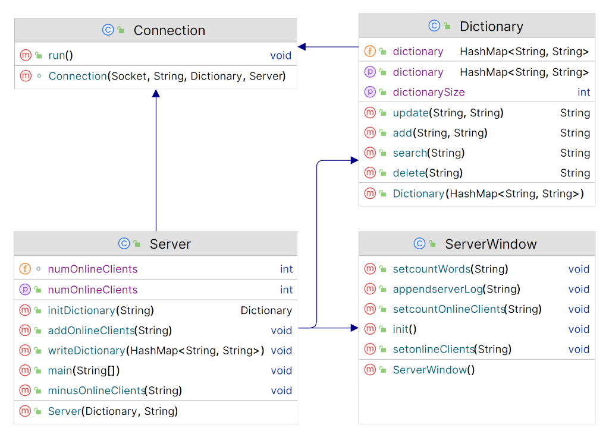

# COMP90015 Distributed Systems

## Assignment 1: Multi-threaded Dictionary Server

**Semester 2 – 2023**

Yifan Shi – 1449015

## Problem Context

The Client-Server is a system architecture model, the clients can make requests and receive services from a remote server and the server is responsible for handling the requests and delivering the services to the client. In this project, a multi-threaded dictionary client-server system is designed and implemented using a Client-Server architecture. This system allows clients to search the meaning(s) of a word, add a new word to the dictionary, update the meaning of the word, and delete a word from the dictionary by using thread per connection with TCP protocol. As for failure handling, command line argument errors, connection errors, I/O errors, are properly managed in this system.

## System Components

The system consists of Server and Client.

### Server

We can use the following command to start the server.

```
java –jar DictionaryServer.jar <port> <dictionary-file>**

    - <port> Choose [10000 – 65535] and server will listen incoming client connections.**

    - <dictionary file> The file path of the dictionary.**
```

After the server is launched, it will start listening for socket connections from clients. Once a socket connection is established, the server will spawn a separate Connection for each client to handle their requests. Since the server is using multi-thread technology, it can handle requests from different clients concurrently. When it comes to data modification, because the relative functions provided by the dictionary controller are synchronized, there will be no ambiguity in modifying the data in the dictionary. Because the server uses multithreading, it can handle requests from different clients simultaneously. Therefore, when data modifications are made, the related functions provided by the dictionary controller are synchronous, which means that only one thread can modify the data in the dictionary at a time. Therefore, no matter how many threads access the dictionary at the same time, there will be no ambiguity or wrong results.

the server also provides a GUI for logging operations and showing information about the server.

### Client

We can use the following command to start the server.

```
java –jar DictionaryCerver.jar <server-address> < server-port >**

    - < server-address > Server address to connect**

    - < server-port > The port that server listen for connections.**
```
The client component is composed of a client that is responsible for sending requests such as SEARCH, ADD, UPDATE, and DELETE to the server. Additionally, there is a client GUI that captures user actions and delivers the server response to the user. The client GUI also includes a feature for detecting idle users, which automatically closes idle connections to optimize resource usage.

## Program Design

### Server Package



Once the Server start, a Dictionary is created with the initial dictionary data from dictionary.txt and a ServerWindow will be launched immediately.

The following ServerWindow is used for monitoring. It counts the number of words in the dictionary, the number of online clients, a online list and system logs.

Connection receives clients request and directly invokes the method from Dictionary and then returns the result back to the client.


### Client Package


Once the Client start, the ClientWindow will be launched immediately.


The ClientWindow is simple to interact with, there are instructions in the top of the window, the Search, Add, Update, and Delete buttons and a text box in the window.


### Interaction Diagram

The following graph is an interaction diagram when a user searches a word:


## Critical Analysis

### Error Handling

This system is also designed to handle errors properly.


|                      **Error**                      |                   **Solution of Errors**                    |
| :-------------------------------------------------: | :---------------------------------------------------------: |
|            Inadequate startup parameters            |              Prevent startup and show sample.               |
|   Input invalid port number(not in [10000-65535])   |       Prevent startup and ask for valid port number.        |
|                     Empty input                     |               Return error and ask for input.               |
|         The dictionary file does not exist          |         Prevent startup and ask for the right path          |
|  Meaning is empty when making ADD, UPDATE request   |               Ask for input a valid meaning.                |
|       Duplicate word when making ADD request        |       Return word already existed in the dictionary.        |
| UPDATE/DELETE a word that is not in the dictionary. | Return word not found in the dictionary, need to add first. |
|                serverPort is in use                 |              ` `Return address already in use.              |


### Advantage

1. Because the server uses multithreading, it can handle requests from different clients simultaneously. Therefore, when data modifications are made, the related functions provided by the dictionary controller are synchronous, which means that only one thread can modify the data in the dictionary at a time.
1. The system classifies almost every kind of error, and feeds back through the log of the ClientWindow and the ServerWindow, so that users and administrators can understand the cause of the error and make the correct operation.

### Disadvantage

1. Because this system uses text files (.txt) to store dictionary data, the entire file needs to be rewritten when modifying data, so storing data in the database will make the whole system more efficient.
1. The entire system does not have an authentication system, so anyone can access the system to modify the data, which makes the server vulnerable to attacks, data contamination, etc. In addition, since there is no length limit on words and their meanings, errors are prone to occur.

### Creativity elements

In order to reduce server pressure and blockage, the system adds user idle detection, if the user does not perform any operation within 60 seconds, the connection to the server will be automatically closed, which greatly improves the stability and efficiency of the system.

## Conclusion

In summary, based on TCP protocol and C/S model, this system realizes a multi-threaded dictionary system, and critically analyzes the pros and cons of the system, and better understands and learns the theoretical knowledge and practical experience of distributed systems.